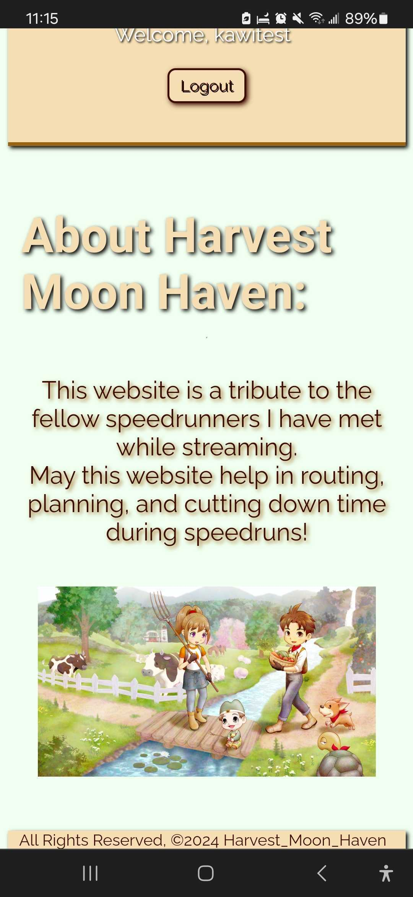
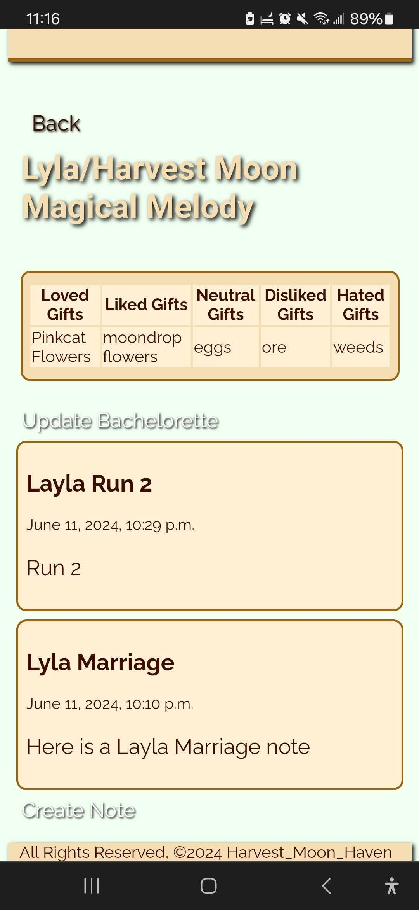
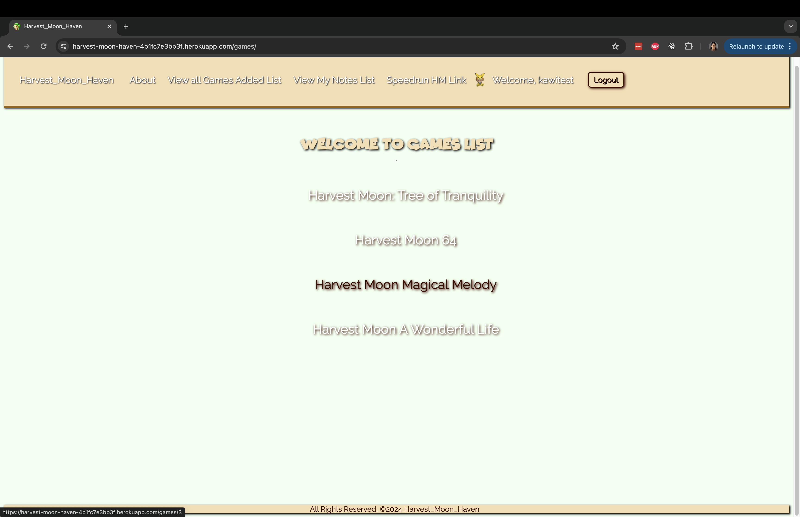
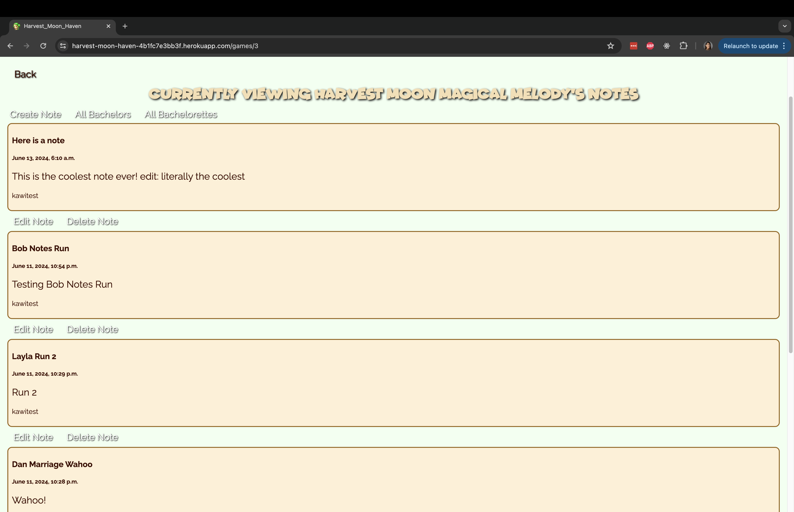

# Harvest Moon Haven 
This is an app I made to give back to the Harvest Moon Speedrunners community. We were always talking about how we wish we had a place with up to date notes and a place that we could refer to that has all the correct information. This app is mmy way of providing this ability to make our own site to maintain the routes and hopefully help users to cut down their time.  

# Screenshots

# Technologies Used

- Python
- HTML
- CSS
- Django
- Pixabay for the WallPaper Image, and The Harvest Moon Discord for the About image
- Harvest Moon Community Assets -> for the favicon, and user sprite
- Favicon Generator
- Heroku
- Postgresql

# Getting Started

[Click to View Project Planning](https://trello.com/b/djijbQLY/project4harvestmoon-haven)
[Click to View Harvest Moon Haven!](https://harvest-moon-haven-4b1fc7e3bb3f.herokuapp.com/)

# Next Steps

- Add approved videos or images to Notes for routing
- Add personal best runs for user in My Notes Section
- Add embedded videos from imgur for the hard strats
- Fix minor bugs
- add more cute graphics
